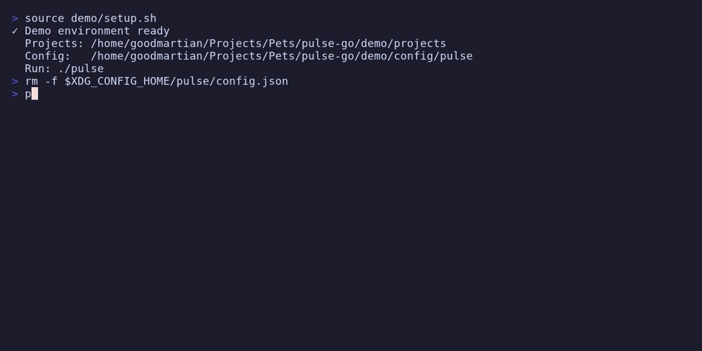

# Pulse Go

Pulse Go is a CLI tool for project tracking, focus management, and idea capture — right in your terminal. The interface is built with the [Charmbracelet](https://charm.sh/) TUI ecosystem.



## Features

- Focus management: set your current task and track how long you've been on it.
- Idea inbox: quickly capture stray ideas so they don't distract you.
- Project map: keep descriptions, tech stacks, and done-criteria for every project.
- Localization: built-in English and Russian UI.
- Interactive TUI: a modern, responsive terminal interface.

## Installation

Requires [Go](https://golang.org/dl/) 1.24+.

```bash
go install github.com/goodmartian/pulse-go/cmd/pulse@latest
```

Make sure `$GOPATH/bin` (or `$HOME/go/bin`) is in your `PATH`:

```bash
export PATH="$PATH:$(go env GOPATH)/bin"
```

**Build from source:**
```bash
git clone https://github.com/goodmartian/pulse-go.git
cd pulse-go
go build -o pulse ./cmd/pulse
```

## Usage

```bash
pulse          # dashboard
pulse help     # list all commands
```

## Data storage

Pulse stores configuration and data locally in OS-standard directories:
- **Linux**: `~/.config/pulse/`
- **macOS**: `~/Library/Application Support/pulse/`
- **Windows**: `%AppData%\pulse`

## License

MIT. See [LICENSE](LICENSE) for details.
